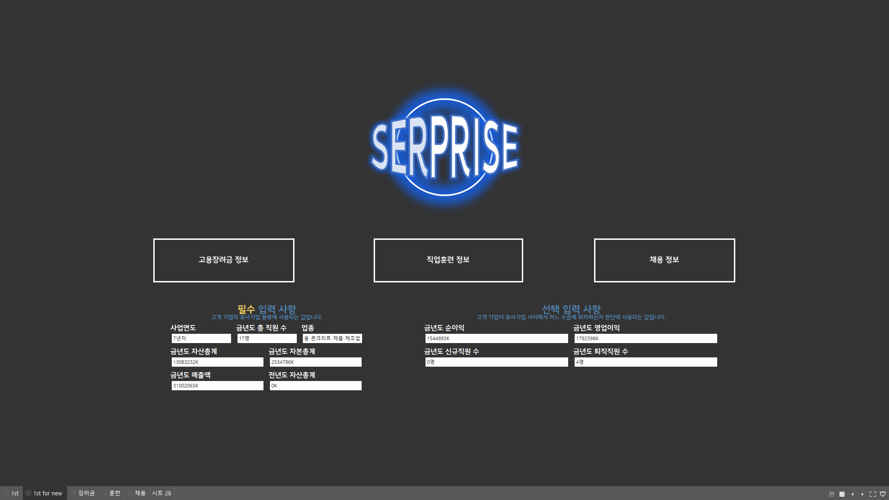

# KEIS_PROJECT

Programming Language : Python  

* 2022 빅리더 AI 아카데미 한국고용정보원팀에서 진행했던 프로젝트 입니다.

* 기업이 고용장려금, 기업직업훈련, 그리고 채용공고 정보를 파악하기 위해, 기존에는 여러 사이트에 분산되어 파편화되어 있던 것을 해결하고자, 자사와 유사한 기업을 추출하고, 유사 기업이 어떻게 하고 있는지를 제공 및 추천하는 프로젝트입니다.

* 한국고용정보원과 같이 진행하였던 프로젝트로, 데이터 제공 및 많은 자문을 해주셨습니다.

* __데이터는 보안상의 이유로 업로드 하지 않았습니다.__

---

* 초기화면은 크게 2가지로, 사업자 번호를 입력하여 

* 사업자 번호를 입력하여 기업 정보를 읽어오는 초기화면

* 사업자 번호없이, 직접 정보를 입력하는 초기화면