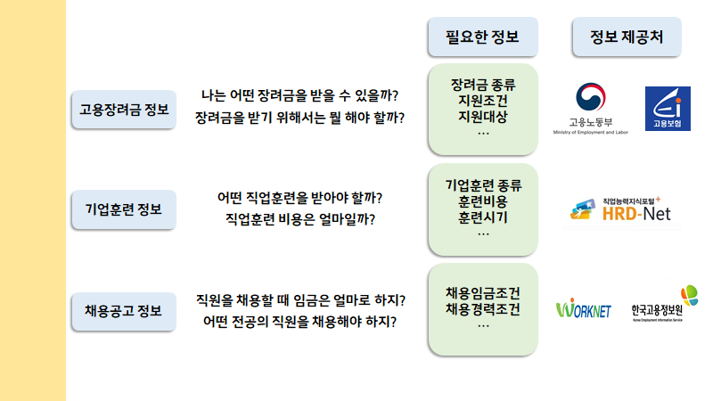
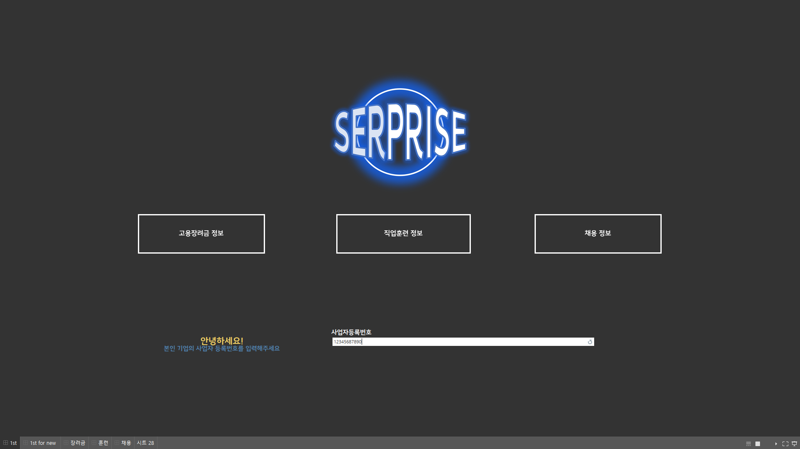
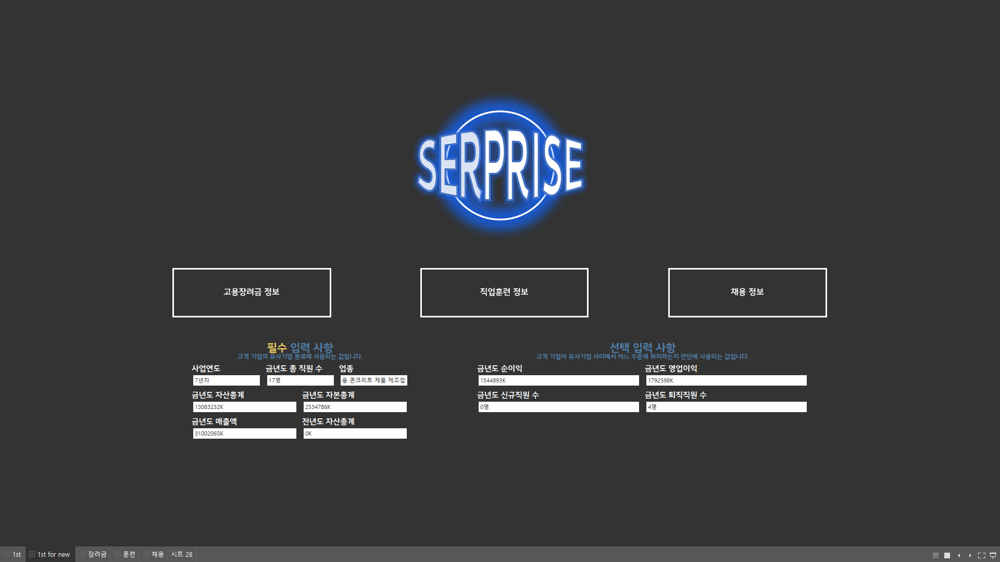
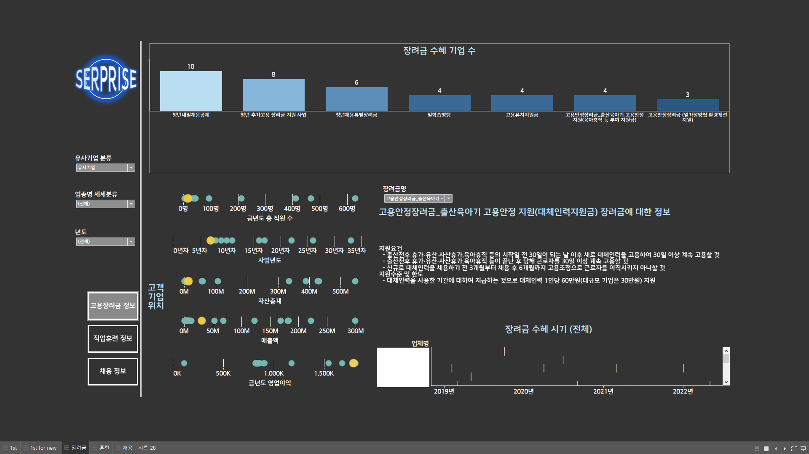
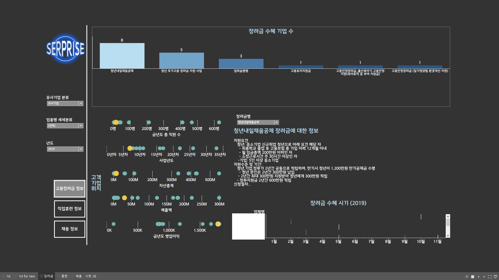
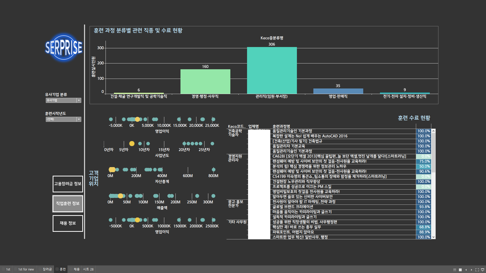
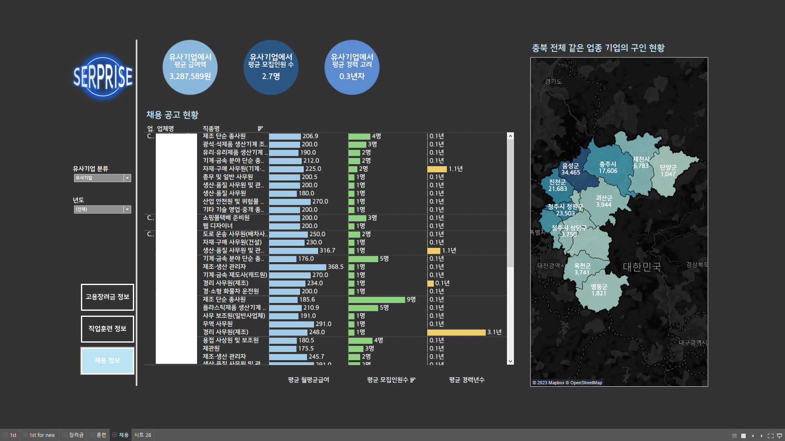
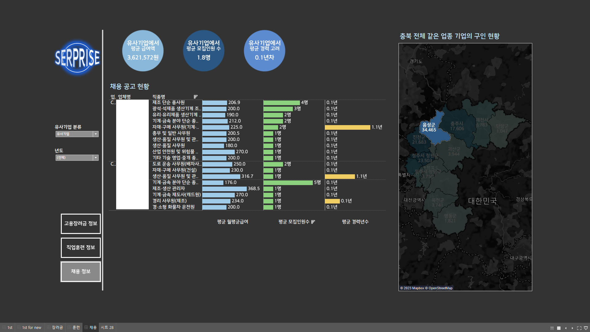

# **SERPRISE**(**SER**ving-for-Enter**PRISE**)

Programming Language : Python  

* 2022 빅리더 AI 아카데미 한국고용정보원팀에서 진행했던 프로젝트의 코드 일부분인 데이터 정제 관련 코드 입니다.
* 프로젝트 기간: 2022/07/25 ~ 2022/08/31

---
# 기업이 겪는 문제점

* 기업이 고용장려금, 기업직업훈련, 그리고 채용공고 정보를 파악하기 위해, 기존에는 여러 사이트에 분산되어 파편화되어 있던 것을 해결하고자, 자사와 유사한 기업을 추출하고, 유사 기업이 어떻게 하고 있는지를 제공 및 추천하는 프로젝트입니다.

* 한국고용정보원과 같이 진행하였던 프로젝트로, 데이터 제공 및 많은 자문을 해주셨습니다.

* 충북지역에 한하여 프로젝트를 진행하였습니다.

* __데이터는 보안상의 이유로 업로드 하지 않았습니다.__

* 시각화는 Tableau를 사용하여 진행하였습니다.

* 같이 고생한 잡포유 팀원에게 감사를 드립니다!
---
# 초기화면

* 초기화면은 크게 2가지로, 사업자 번호를 입력하는 방식과 다른 필요 정보를 직접 입력하는 방식이 있습니다. 

|||
|--|--|
| 사업자번호로 기업 정보를 읽어오는 초기화면| 사업자번호없이, 직접 정보를 입력하는 초기화면|

---
# 고용장려금 화면

* 유사한 기업이 받고있는 고용 장려금을 내림차순으로 소개합니다.
* 고객 기업 위치로 유사기업에서 본인 기업이 어느정도인지 알수 있습니다.

* 연도를 선택하여 특정연도에 받은 장려금을 확인할 수 있으며, 특정 장려금을 선택해 그 장려금만 받은 기업들만 확인할 수도 있습니다.
---
# 기업직업훈련 화면

* 유사한 기업이 시행하고 잇는 기업직업훈련을 내림차순으로 소개합니다.
* 특정 기업이 훈련을 시행하여 끝까지 완료한 현황을 훈련 수료 현황으로 확인할 수 있습니다.
---
# 채용공고 화면

* 유사한 기업의 채용공고를 내림차순으로 소개합니다.

* 특정 지역을 선택하면 그 지역에 속한 유사기업의 정보만을 참고할 수 있습니다.
